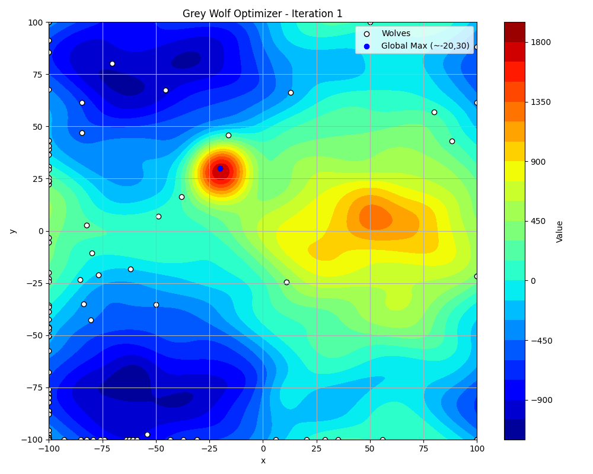

# Grey Wolf Optimizer (GWO) Visualization

This repository contains an implementation of the **Grey Wolf Optimizer (GWO)**, a nature-inspired optimization algorithm that mimics the leadership hierarchy and hunting mechanism of grey wolves. The algorithm is used to find the optimal solution to a given function.

## Features

- **GWO Algorithm Implementation**: Simulates the hunting strategy of grey wolves to optimize a function.
- **Visualization with GIF Output**: Tracks and visualizes the movement of the wolves over iterations.
- **Customizable Parameters**: Adjust the number of wolves, iterations, and search space.

## Requirements

To run the code, ensure you have the following dependencies installed:

```bash
pip install numpy matplotlib pillow
```

## Function Definition

The function to be optimized is designed with various mathematical components:

- A sinusoidal base function
- A well-defined global maximum near (-20,30)
- Several local maxima and minima
- Random noise to introduce complexity
- A boundary effect to constrain the function’s domain

```python

def f(x, y):
    base = 500 * (np.sin(0.03*x) + np.cos(0.04*y))
    dist_global = np.sqrt((x+20)**2 + (y-30)**2)
    global_max = 2000 * np.where(dist_global < 1.5, 1, np.exp(-dist_global**2/200))  
    local_max1 = 300 * np.exp(-((x-50)**2 + (y-10)**2)/150)
    local_min1 = -200 * np.exp(-((x+60)**2 + (y+70)**2)/100)
    local_max2 = 250 * np.exp(-((x-10)**2 + (y+80)**2)/120)
    noise = 80 * (np.sin(0.1*x + np.cos(0.15*y)) + np.cos(0.12*y + np.sin(0.08*x)))
    boundary = -0.003 * (x**2 + y**2)
    
    return base + global_max + local_max1 + local_min1 + local_max2 + noise + boundary
```
<p align="center">
  
</p>

## How the Grey Wolf Optimizer Works

The Grey Wolf Optimizer (GWO) was introduced by Seyedali Mirjalili, et al., in the paper **"Grey Wolf Optimizer"** (2014). The algorithm is inspired by the social hierarchy and hunting behavior of grey wolves in nature.

### Social Hierarchy of Wolves

Grey wolves (Canis lupus) follow a strict hierarchy consisting of:

1. **Alpha Wolves (α)** - The leaders of the pack, responsible for decision-making.
2. **Beta Wolves (β)** - The second-in-command, assisting the alpha in decision-making.
3. **Delta Wolves (δ)** - The subordinates that enforce rules and protect the pack.
4. **Omega Wolves (ω)** - The lowest-ranked wolves, who follow the leadership of others.

### Mathematical Model of GWO

The optimization process in GWO is modeled as follows:

#### 1. **Encircling Prey**

Grey wolves encircle prey by updating their positions based on the best three wolves:

```
D = |C * X_p - X|
X(t+1) = X_p - A * D
```

Where:

- `X_p` is the position of a leading wolf (alpha, beta, or delta).
- `X` is the position of a given wolf.
- `A` and `C` are coefficient vectors controlling exploration and exploitation.

#### 2. **Hunting (Exploitation)**

The three best solutions guide the search by adjusting wolf positions:

```
X_1 = X_alpha - A_1 * D_alpha
X_2 = X_beta - A_2 * D_beta
X_3 = X_delta - A_3 * D_delta
```

The wolves' new positions are updated as:

```
X(t+1) = (X_1 + X_2 + X_3) / 3
```

#### 3. **Attacking the Prey (Exploitation)**

As the wolves get closer to the prey, the coefficient `a` gradually decreases over iterations, reducing the step size and enhancing exploitation. This helps the wolves fine-tune their search and converge toward the optimal solution.

```
a = 2 - (2 * t / T)
```

Where:
- `t` is the current iteration.
- `T` is the total number of iterations.

A lower `a` value results in smaller steps, allowing wolves to focus on local search rather than global exploration.

#### 4. **Search for Prey (Exploration)**

When `|A| > 1`, wolves move further to explore new regions. When `|A| < 1`, they converge toward the best solution.


## Example Visualization

Below is an example of the Grey Wolf Optimizer in action, showing the movement of wolves over iterations:

<p align="center">
  
</p>
This GIF represents the optimization process as the wolves move towards the best solution.

## Contributions

Feel free to fork this repository, open issues, and submit pull requests if you want to improve the implementation or add new features.

## License

This project is licensed under the MIT License.

