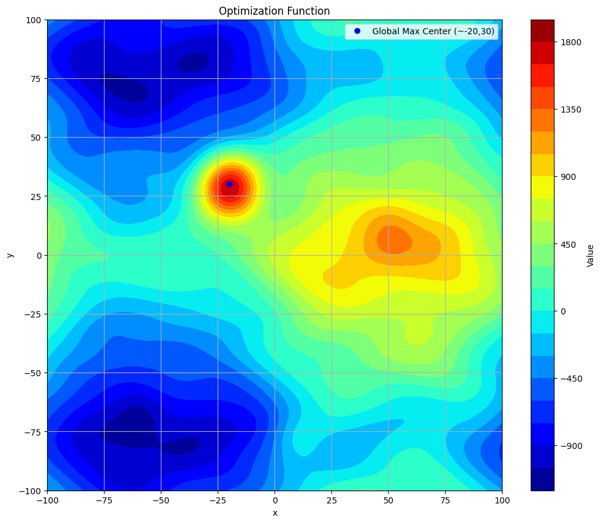
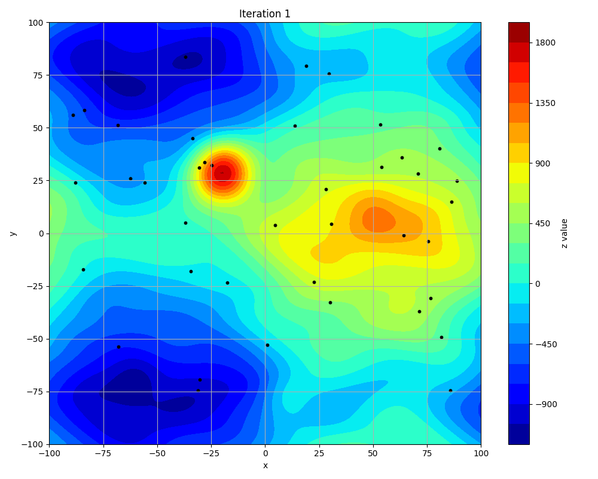

# Particle Swarm Optimization (PSO) Visualization

## Overview

This repository presents an implementation of the Particle Swarm Optimization (PSO) algorithm for optimizing a complex mathematical function. The function features multiple local maxima and minima, with a prominent global maximum situated near (-20, 30). A GIF visualization illustrates the dynamic movement of particles throughout the optimization process, demonstrating their convergence towards optimal solutions.

This implementation is inspired by concepts detailed in [this YouTube video](https://www.youtube.com/watch?v=JqTASBiMVT8&ab_channel=EngineerHunter).

## Function Definition

The function to be optimized is designed with various mathematical components:

- A sinusoidal base function
- A well-defined global maximum near (-20,30)
- Several local maxima and minima
- Random noise to introduce complexity
- A boundary effect to constrain the function’s domain

```python
# Function definition

def f(x, y):
    base = 500 * (np.sin(0.03*x) + np.cos(0.04*y))
    dist_global = np.sqrt((x+20)**2 + (y-30)**2)
    global_max = 2000 * np.where(dist_global < 1.5, 1, np.exp(-dist_global**2/200))  
    local_max1 = 300 * np.exp(-((x-50)**2 + (y-10)**2)/150)
    local_min1 = -200 * np.exp(-((x+60)**2 + (y+70)**2)/100)
    local_max2 = 250 * np.exp(-((x-10)**2 + (y+80)**2)/120)
    noise = 80 * (np.sin(0.1*x + np.cos(0.15*y)) + np.cos(0.12*y + np.sin(0.08*x)))
    boundary = -0.003 * (x**2 + y**2)
    
    return base + global_max + local_max1 + local_min1 + local_max2 + noise + boundary
```
<p align="center">
  
</p>

## Particle Swarm Optimization (PSO)

Particle Swarm Optimization (PSO) is a population-based stochastic optimization technique inspired by the social behavior of birds and fish. It is widely used in optimization problems where traditional gradient-based methods struggle due to non-linearity or the presence of multiple local optima. PSO models a system where multiple particles, representing candidate solutions, explore the search space to find the optimal solution.

Each particle maintains a position and velocity, which determine its movement within the search space. The velocity of a particle is influenced by three factors: its inertia (momentum from previous movement), a cognitive component that attracts it toward its personal best position, and a social component that directs it toward the global best position found by the swarm. These influences are weighted by specific parameters, including an inertia weight that decreases over time to balance exploration and exploitation. The acceleration coefficients \(c1\) and \(c2\) regulate the influence of personal and global experience, ensuring that the particles explore efficiently while converging toward an optimal solution.

The algorithm iterates for a predefined number of steps or until a stopping criterion is met. Throughout the process, particles share information indirectly by updating the global best position whenever a more optimal solution is found. This cooperative mechanism enhances convergence speed and robustness against local optima.

This implementation follows the approach demonstrated in the [Engineer Hunter](https://www.youtube.com/@EngineerHunter) YouTube channel, illustrating PSO’s effectiveness in solving complex optimization problems with visualizations that depict particle movement over successive iterations.

### Particle Class Implementation

```python
class Particle:
    def __init__(self):
        self.positon = np.random.uniform(xMin, xMax, [ps, d])
        self.velocity = np.random.uniform(vMin, vMax, [ps, d])
        self.cost = -f(self.positon[:, 0], self.positon[:, 1])
        self.pbest = np.copy(self.positon)
        self.pbest_cost = np.copy(self.cost)
        self.index = np.argmin(self.pbest_cost)
        self.gbest = self.pbest[self.index].copy()
        self.gbest_cost = self.pbest_cost[self.index]
        self.bestcost = np.zeros(n_iter)
```

### Optimization Execution

```python
fun = Particle()
best_solution, best_value, particle_positions = fun.evaluate()
print(f"Best Solution: {best_solution}")
print(f"Best Value: {-best_value}")
```

## Visualization

The particle movement throughout the optimization process is captured in an animated GIF. The background represents the contour plot of the objective function, while the particles, displayed as black points, move progressively toward optimal solutions. The title of each frame indicates the current iteration of the optimization process.

```python
gif_path = "particle_swarm_optimization.gif"
frames[0].save(gif_path, save_all=True, append_images=frames[1:], duration=100, loop=0)
print(f"GIF saved at: {gif_path}")
```

<p align="center">
  
</p>

## How to Run

1. Install dependencies:
   ```bash
   pip install numpy matplotlib pillow
   ```
2. Execute the Python script:
   ```bash
   python script.py
   ```
3. View the generated GIF `particle_swarm_optimization.gif`

## References

- [Engineer Hunter - PSO Video](https://www.youtube.com/watch?v=JqTASBiMVT8&ab_channel=EngineerHunter)

## License

This project is licensed under the MIT License.

