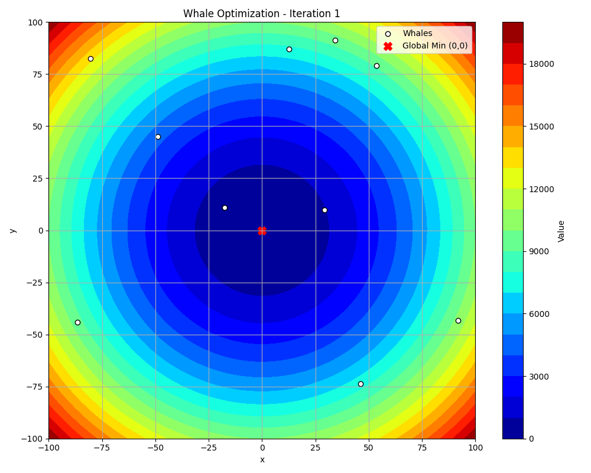

---

# **Whale Optimization Algorithm (WOA) - Benchmark Functions**

## **1️⃣ Overview of WOA**

The Whale Optimization Algorithm (WOA) is a nature-inspired metaheuristic optimization technique introduced by Seyedali Mirjalili in 2016. It is based on the unique hunting strategy of humpback whales, known as **bubble-net feeding**.  

In this strategy, humpback whales encircle their prey by creating spiral movements and gradually narrowing the loop before striking. WOA mathematically models this behavior to explore and exploit the search space, refining candidate solutions iteratively. By mimicking the whales' encircling, spiral motion, and adaptive shrinking mechanism, WOA effectively balances exploration and exploitation, making it a powerful tool for solving complex optimization problems.

---

## **2️⃣ How WOA Works**

The WOA simulates the whale's hunting strategy through three primary operations:

### **A. Encircling Prey (Exploitation)**

Whales identify the best candidate solution (prey) and update their positions relative to it:

Where:  
- \( \vec{X^*} \) is the best solution found so far (prey).  
- \( \vec{X} \) represents the whale’s current position.  
- \( \vec{A} \) and \( \vec{C} \) are coefficient vectors controlling convergence.  

---

### **B. Spiral Update (Exploitation)**

If the probability \( p \geq 0.5 \), the whale follows a **spiral path** instead of direct encircling:

)

Where:  
- \( b \) controls the spiral shape.  
- \( l \) is a random number in **[-1,1]**.  

---

### **C. Search for Prey (Exploration)**

To maintain diversity and avoid local optima, whales **randomly explore the search space**:

Where \( \vec{X}_{rand} \) is a **random whale**.

---

### **D. Adaptive Parameters**

The **coefficient vectors** help control exploration vs. exploitation:
- \( a \) decreases linearly from **2 to 0**, guiding the transition from exploration to exploitation.  
- \( A \) and \( C \) depend on random values for stochastic behavior.  

---

## **3️⃣ Benchmark Functions Used**

To evaluate WOA, we apply it to **five well-known optimization functions**:

| **Function**  | **Formula** | **Global Minimum** |
|--------------|------------|------------------|
| **Sphere** | &space;=&space;\sum&space;x_i^2) | \( (0,0) \), \( f(0) = 0 \) |
| **Rastrigin** | &space;=&space;10n&space;&plus;&space;\sum&space;[x_i^2&space;-&space;10&space;\cos(2\pi&space;x_i)]) | \( (0,0) \), \( f(0) = 0 \) |
| **Rosenbrock** | &space;=&space;\sum&space;[100&space;(x_{i&plus;1}&space;-&space;x_i^2)^2&space;&plus;&space;(x_i&space;-&space;1)^2]) | \( (1,1) \), \( f(1) = 0 \) |
| **Ackley** | &space;=&space;-20&space;e^{-0.2&space;\sqrt{(1/n)&space;\sum&space;x_i^2}}&space;-&space;e^{(1/n)&space;\sum&space;\cos(2\pi&space;x_i)}&space;&plus;&space;20&space;&plus;&space;e) | \( (0,0) \), \( f(0) = 0 \) |
| **Griewank** | &space;=&space;1&space;&plus;&space;(1/4000)&space;\sum&space;x_i^2&space;-&space;\prod&space;\cos(x_i&space;/&space;\sqrt{i})) | \( (0,0) \), \( f(0) = 0 \) |

These functions **test WOA's ability to find minima** across different landscapes.
In this project, we use **five well-known benchmark functions** to test the Whale Optimization Algorithm (WOA):

### **1. Sphere Function**
- **Formula**: &space;=&space;\sum&space;x_i^2)
- **Description**: A simple, convex function with a single global minimum. It tests the algorithm's ability to converge to a single optimal point.
- **Global Minimum**: \( f(0, 0) = 0 \)

### **2. Rastrigin Function**
- **Formula**: &space;=&space;10n&space;&plus;&space;\sum&space;[x_i^2&space;-&space;10&space;\cos(2\pi&space;x_i)])
- **Description**: A highly multimodal function with many local minima. It tests the algorithm's ability to avoid local optima and find the global minimum.
- **Global Minimum**: \( f(0, 0) = 0 \)

### **3. Rosenbrock Function**
- **Formula**: &space;=&space;\sum&space;[100&space;(x_{i&plus;1}&space;-&space;x_i^2)^2&space;&plus;&space;(x_i&space;-&space;1)^2])
- **Description**: A non-convex function with a narrow, parabolic valley. It tests the algorithm's ability to navigate through curved and flat regions.
- **Global Minimum**: \( f(1, 1) = 0 \)

### **4. Ackley Function**
- **Formula**: &space;=&space;-20&space;e^{-0.2&space;\sqrt{(1/n)&space;\sum&space;x_i^2}}&space;-&space;e^{(1/n)&space;\sum&space;\cos(2\pi&space;x_i)}&space;&plus;&space;20&space;&plus;&space;e)
- **Description**: A multimodal function with many local minima and a nearly flat outer region. It tests the algorithm's ability to escape flat regions and converge to the global minimum.
- **Global Minimum**: \( f(0, 0) = 0 \)

### **5. Griewank Function**
- **Formula**: &space;=&space;1&space;&plus;&space;(1/4000)&space;\sum&space;x_i^2&space;-&space;\prod&space;\cos(x_i&space;/&space;\sqrt{i}))
- **Description**: A function with many regularly distributed local minima. It tests the algorithm's ability to balance exploration and exploitation.
- **Global Minimum**: \( f(0, 0) = 0 \)

These functions are chosen to evaluate WOA's performance across different landscapes, including convex, non-convex, multimodal, and flat regions. By testing WOA on these functions, we can assess its ability to find global minima and avoid getting trapped in local optima.

---

## **4️⃣ GIF Visualizations**

We used the Whale Optimization Algorithm (WOA) to optimize functions with a population of 10 whales over 150 iterations. The results were satisfactory for all functions except Rosenbrock. However, by increasing the whale population by 30, we achieved better optimization for Rosenbrock as well. The improved result is available in the Images folder under the name Rosenbrock Function2.gif.

<table align="center">
  <tr>
    <td align="center"><strong>Sphere</strong></td>
    <td align="center"><strong>Rastrigin</strong></td>
  </tr>
  <tr>
    <td align="center"></td>
    <td align="center"></td>
  </tr>
  <tr>
    <td align="center"><strong>Rosenbrock</strong></td>
    <td align="center"><strong>Ackley</strong></td>
  </tr>
  <tr>
    <td align="center"></td>
    <td align="center"></td>
  </tr>
  <tr>
    <td colspan="2" align="center"><strong>Griewank</strong></td>
  </tr>
  <tr>
    <td colspan="2" align="center"></td>
  </tr>
</table>

## **5️⃣ Optimization Results**

Below is a table showing the **best solution found** for each function for n=10,iter=150 :

| **Function**  | **Best (x, y) Found** | **WOA Cost** | **Optimal Cost** |
|--------------|----------------------|-------------|-----------------|
| **Sphere** |  [3.74132678e-18 , 5.03965651e-19] | 1.425150744918506e-35 | [0,0] |
| **Rastrigin** | [-1.49336736e-10  4.13576451e-10] | 0.0 | [0,0] |
| **Rosenbrock** | [0.72233299 , 0.51784078] | 0.0786388788804827 | [1,1] |
| **Ackley** | [-7.16185498e-17 , -1.48101134e-16] |  4.440892098500626e-16  | [0,0] |
| **Griewank** | [-2.21376396e-09 , 8.60352070e-09] | 0.0 | [0,0] |

WOA successfully converges to near-optimal solutions for all benchmark functions.

---

## **6️⃣ Reference**

- Mirjalili, S. (2016). **"The Whale Optimization Algorithm"**. *Advances in Engineering Software, 95, 51-67*. [DOI: 10.1016/j.advengsoft.2016.01.008](https://doi.org/10.1016/j.advengsoft.2016.01.008)

---
## 📜 License  

This project is licensed under the **MIT License**, allowing free use, modification, and distribution.  

## 🤝 Get in Touch  

Feel free to reach out if you have any questions or are interested in collaboration! 🚀
